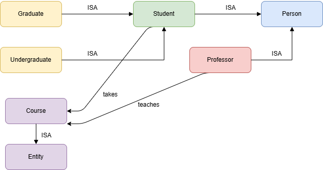

# Отчёт по лабораторной работе 1

# Лазарев Ярослав Б23-514

## Цель
Построить фрагмент предметной области в SNePS для сценария «Университет»: задать иерархию ISA, определить экземпляры и проверить выводы по отношениям `takes` и `teaches`.

## Что сделано
- Выбрана предметная область «Университет».
- Определены понятия: `Person`, `Student`, `Undergraduate`, `Graduate`, `Professor`, `Course`.
- Добавлены отношения `takes` и `teaches`.
- Реализован Go POC: пакеты `ontology` (концепты, иерархии), `kripke` (фреймы миров/доступности), `scenarios` (билдеры сценариев под 2 предметные области) и `cmd/poc` (интерактивный CLI).
- Добавлены тесты для `ontology` и примерные сценарии для проверки `instance-of`, `ISA` и `rel-ISA`.

- `Undergraduate -> Student -> Person` и `Graduate -> Student -> Person` задают наследование.
- `Professor -> Person` добавляет отдельную ветку иерархии.
- `instance-of` позволяет задавать экземпляры для студентов, преподавателей и курса.
- На основе этих данных реализованы проверки `instance-of`, `ISA` и `rel-ISA` в Go-поc.

## Вывод
Модель предметной области для ЛР1 реализована как Go POC и проверена через тесты и интерактивный CLI. Иерархия `ISA` и проверки по отношениям `takes`/`teaches` функционируют согласно ожиданиям.